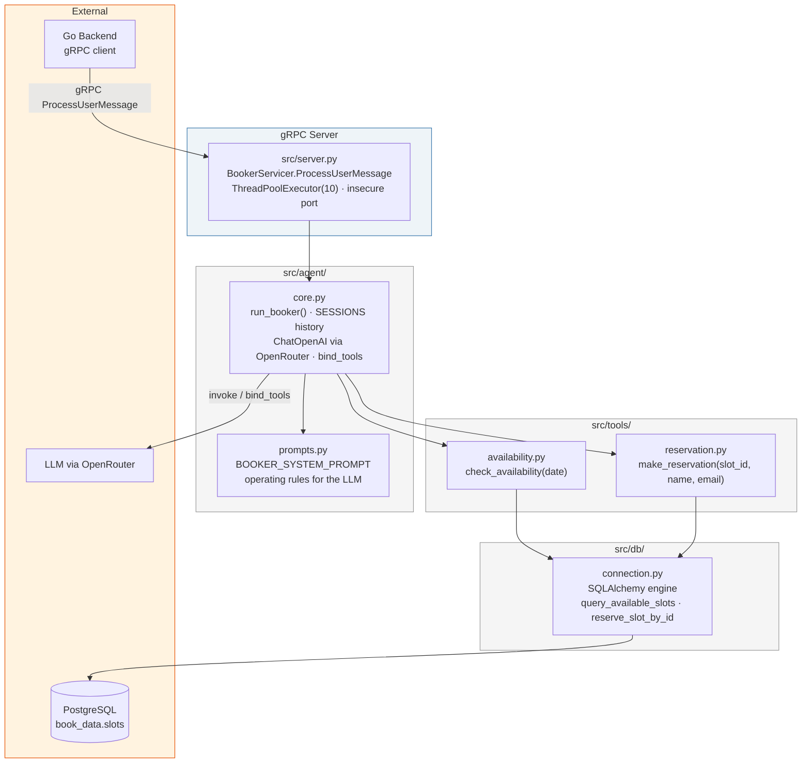
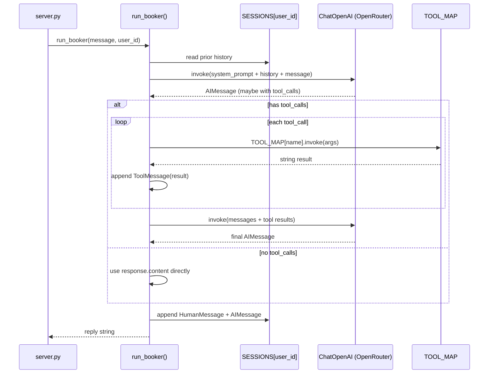

<div align="center">

# syncpulse-booker

**The AI agent service at the edge of SyncPulse** — a LangChain tool-calling agent exposed over gRPC, backing the `llm` user in chat.

[](https://python.org)
[](https://langchain.com)
[](https://grpc.io)
[](https://postgresql.org)
[](https://openrouter.ai)
[](#security--known-limitations)

Part of the [SyncPulse](#) system · [Flutter client →](#) · [Go backend →](#)

[Architecture](#architecture) · [Agent Loop](#agent-loop) · [Tools](#tools) · [gRPC Contract](#grpc-contract) · [Setup](#setup--installation) · [Security](#security--known-limitations)

</div>

---

## Overview

`syncpulse-booker` is a small Python gRPC server that wraps a single LangChain tool-calling agent. It has exactly one job: take a chat message forwarded from the Go backend, decide (via an LLM) whether it needs to check availability or make a reservation, run the matching Postgres query, and return a natural-language reply.

It owns its own datastore (`book_data`, specifically the `slots` table) and never talks to the chat backend's `chatdb` or to the Flutter client — the Go backend is the only caller, over gRPC, and the client only ever sees the agent as the reserved `llm` chat user.

## Architecture



**Design notes:**
- **`server.py` is a thin adapter** — it does no LLM or DB work itself. It unmarshals the gRPC request, calls `run_booker(message, user_id)`, and wraps the result back into a `BookerResponse`. Any exception from the agent loop is caught and surfaced as a gRPC `INTERNAL` status rather than crashing the worker thread.
- **`core.py` is the only place tools get bound to the model** — `TOOL_MAP` is a single dict of `{name: @tool-decorated function}`, and the same dict is used both to build the `bind_tools()` list and to dispatch tool calls the LLM asks for. Adding a third tool means adding one entry here.
- **Tools never touch the LLM or gRPC layer** — `availability.py` and `reservation.py` each wrap exactly one function in `src/db/connection.py` and return a plain string. That string is what the LLM sees as the tool result, so the DB layer's job is to produce agent-readable text, not structured data.

## Agent Loop

`run_booker()` in `src/agent/core.py` runs a bounded, two-step tool loop per message — not an open-ended agent executor:



- **Conversation history is per-`user_id`**, kept in the module-level `SESSIONS` dict — a fresh list is created the first time a `user_id` is seen, and every turn appends the user's message and the agent's final reply to it.
- **Tool calls only get one follow-up round.** If the LLM's first response includes `tool_calls`, every tool in that batch is executed and fed back as `ToolMessage`s, then the LLM is invoked exactly once more for a final answer — it can't chain a third round of tool calls on the same turn.
- **The reply always resolves to a string.** If the second LLM call comes back with no content (some models return empty content alongside tool calls), the loop falls back to joining the raw tool outputs so the user still gets something.

## Tools

| Tool | File | Signature | What it does |
|---|---|---|---|
| `check_availability` | `src/tools/availability.py` | `date: str` (`YYYY-MM-DD`) | Queries `slots` for rows where `status = 'available'` on that date, returns a formatted list of `Slot #id: start – end`, or a "no open slots" message. |
| `make_reservation` | `src/tools/reservation.py` | `slot_id: int, client_name: str, client_email: str` | `UPDATE`s the matching row to `status = 'booked'` with the client's name/email, guarded by `... AND status = 'available'` so a slot can't be double-booked. Returns whether it succeeded. |

Both tools are plain functions decorated with LangChain's `@tool`, so their docstrings *are* the tool descriptions the LLM sees — `BOOKER_SYSTEM_PROMPT` (in `src/agent/prompts.py`) additionally tells the model to check availability before booking, to collect slot ID + name + email before calling `make_reservation`, and to ask for anything missing rather than guessing.

## Database

`book_data.slots` — owned entirely by this service, queried through `src/db/connection.py` (SQLAlchemy, `psycopg2` driver).

| Column | Type | Notes |
|---|---|---|
| `id` | int | Slot ID, referenced by `make_reservation` |
| `booking_date` | date | Matched against `check_availability`'s `date` arg |
| `start_time` / `end_time` | time | Shown to the user as-is |
| `status` | text | `available` \| `booked` \| `pending` |
| `client_name` / `client_email` | text | Populated on reservation |
| `created_at` | timestamptz | Row creation time |

## gRPC Contract

Defined in `src/proto/booker.proto` (package `booker`, Go package `github.com/amine/syncpulse/proto/booker` — the Go backend generates its client stubs from the same file):

```protobuf
service BookerService {
  rpc ProcessUserMessage (BookerRequest) returns (BookerResponse);
}

message BookerRequest {
  string user_id = 1;
  string message = 2;
}

message BookerResponse {
  string reply = 1;
  bool tool_executed = 2;
}
```

The server currently always returns `tool_executed: true` on success (`server.py` doesn't distinguish tool-augmented replies from plain ones) — the Go backend's "used a tool" indicator is driven by this flag today regardless of whether a tool actually ran.

## Setup & Installation

### Prerequisites
- Python 3.12+
- PostgreSQL, with a `book_data` database and a seeded `slots` table
- An OpenRouter API key

### 1. Environment

Create a `.env` in the project root:

```bash
cat > .env << 'EOF'
DB_HOST=localhost
DB_PORT=5432
DB_NAME=book_data
DB_USER=postgres
DB_PASSWORD=devpass

GRPC_PORT=50051
MODEL_NAME=<an OpenRouter model slug, e.g. openai/gpt-4o-mini>
OPENROUTER_API_KEY=<your key>
EOF
```

| Variable | Required | Default | Notes |
|---|:---:|---|---|
| `DB_HOST` / `DB_PORT` / `DB_NAME` / `DB_USER` | ❌ | `localhost` / `5432` / `book_data` / `postgres` | Falls back quietly if unset — see [Security](#security--known-limitations) |
| `DB_PASSWORD` | ❌ | empty | Connection URL is built without a password segment if empty |
| `GRPC_PORT` | ❌ | `50051` | Must match `BOOKER_GRPC_ADDR` on the Go backend |
| `MODEL_NAME` | ✅ | — | `run_booker()` raises immediately if unset |
| `OPENROUTER_API_KEY` | ✅ | — | `run_booker()` raises immediately if unset |

### 2. Install & run

```bash
python -m venv venv
source venv/bin/activate
pip install -r requirements.txt

python -m src.server
# 🚀 Booker gRPC Service active on port 50051...
```

### 3. Test without the Go backend

`src/client_test.py` opens a plaintext gRPC channel to `localhost:50051` and sends one availability request end-to-end:

```bash
python -m src.client_test
```

`src/db/connection.py` can also be run directly (`python -m src.db.connection`) to sanity-check the Postgres connection and print available slots for a hardcoded test date.

## Project Structure

```
booker-agent-service/
├── src/
│   ├── server.py                # gRPC entry point, BookerServicer
│   ├── client_test.py           # standalone gRPC smoke test
│   ├── config.py                # (currently empty — env vars are read ad hoc via os.getenv)
│   ├── agent/
│   │   ├── core.py              # run_booker(), SESSIONS, LLM + tool binding
│   │   └── prompts.py           # BOOKER_SYSTEM_PROMPT
│   ├── tools/
│   │   ├── availability.py      # check_availability tool
│   │   └── reservation.py       # make_reservation tool
│   ├── db/
│   │   ├── connection.py        # SQLAlchemy engine, slot queries
│   │   └── booking_data.csv     # seed data
│   └── proto/
│       ├── booker.proto         # source of truth for the gRPC contract
│       ├── booker_pb2.py        # generated
│       └── booker_pb2_grpc.py   # generated
├── booker.proto                 # duplicate copy at repo root — see Known Limitations
├── requirements.txt
├── pyproject.toml                # (currently empty)
└── Dockerfile                    # (currently empty — no containerized build yet)
```

## Security & Known Limitations

Built as part of a portfolio-project sprint — see the [SyncPulse master README](#) for the full picture. Agent-service-specific items to fix before any real deployment:

| Issue | Where | Fix |
|---|---|---|
| Conversation memory is an in-process dict | `agent/core.py`, `SESSIONS` | Lost on restart, doesn't scale past one instance — move to Redis/Postgres-backed history |
| gRPC server has no auth and binds an insecure port | `server.py`, `add_insecure_port` | Fine behind a private network for a demo; add TLS + auth before exposing beyond localhost |
| DB credentials silently default to `localhost`/`postgres`/empty password | `db/connection.py` | Fail startup if `DB_HOST`/`DB_USER` aren't set explicitly, same as the Go backend does for `JWT_SECRET` |
| `tool_executed` is hardcoded `true` | `server.py` | Should reflect whether `run_booker()` actually triggered a tool call |
| No rate limiting or per-user request throttling | `server.py` | Add limiting at the gRPC interceptor level |
| Two copies of `booker.proto` (`src/proto/` and repo root) plus a separate Go-side copy | `src/proto/`, `booker.proto` | Maintained by hand today and can drift — needs one shared source of truth (e.g. a proto-only submodule or codegen step in CI) |
| `config.py`, `pyproject.toml`, `Dockerfile` are placeholders | root / `src/` | Configuration currently lives in ad hoc `os.getenv()` calls scattered across files; no containerized build exists yet |

What's already handled well and worth keeping as-is: the tool loop is deliberately bounded (no risk of an unbounded agentic loop), the `TOOL_MAP` pattern keeps adding a new tool to a one-line change, and `reserve_slot_by_id`'s `WHERE status = 'available'` guard prevents a race where two users book the same slot.

## License

MIT — see [LICENSE](LICENSE).

<div align="center">

[← Back to SyncPulse](#) · [[Flutter client](https://github.com/Amine-DevAI/syncpulse-flutter) →] · [[Go backend](https://github.com/Amine-DevAI/syncpulse-backend) →]

</div>
